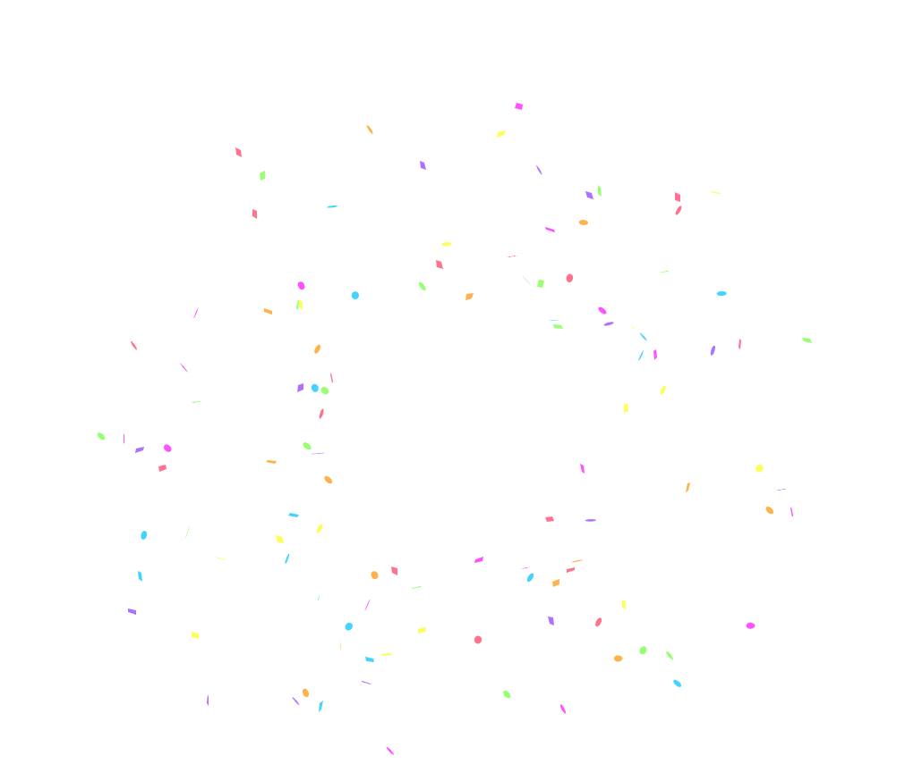
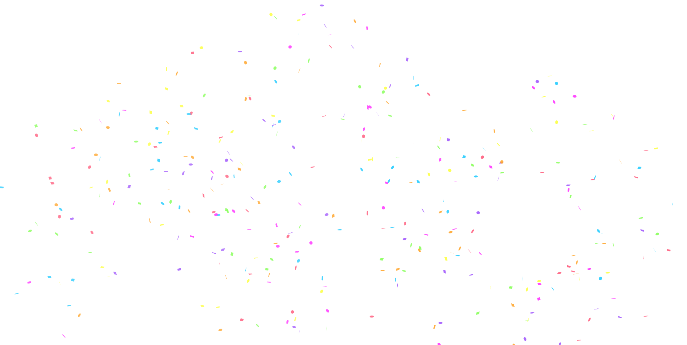
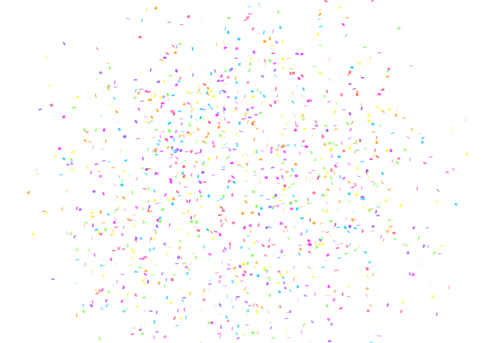

### Очень маленький и прикольный проект - сайтик с конфетти 🎉🥳🎊

Это очень простой проект - при открытии .html страницы, по нажатию мышки в любом её месте, появится феерверк конфетти ✨

Для того что бы запустить проект - откройте файл localhost.html в папке "Сайт с конфетти"

Также, можете посмотреть всё на этой страничке: https://gogortey.ru/MyLibrary/Confetti/localhost.html

Когда я создавал свой большой сайт-проект на JS, то я захотел добавить в него на главную страницу рассыпные конфетти, которые бы появлялись при введении верного значения. Но я никак не мог этого сделать - данная фича была доступна в библиотеках Node.js, но для их подключения требовалось использовать метод require, а данный метод не запускался в файлах JS, исполняемых на web-страницах

Но потом я всё-же нашёл решение: Нужно было установить сборщик пакетов, который собирает все зависимости в JS файлах, прилинкованных через require - в один файл, который можно запустить на web странице

И библиотека с конфетти - была первой, которую я собрал в бандл и запустил на сайте ⭐ 

